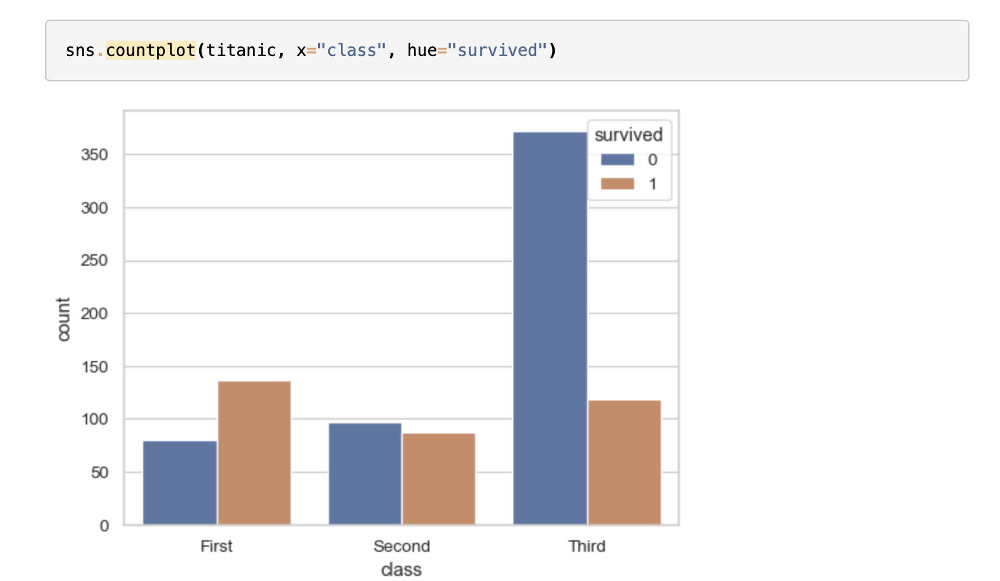
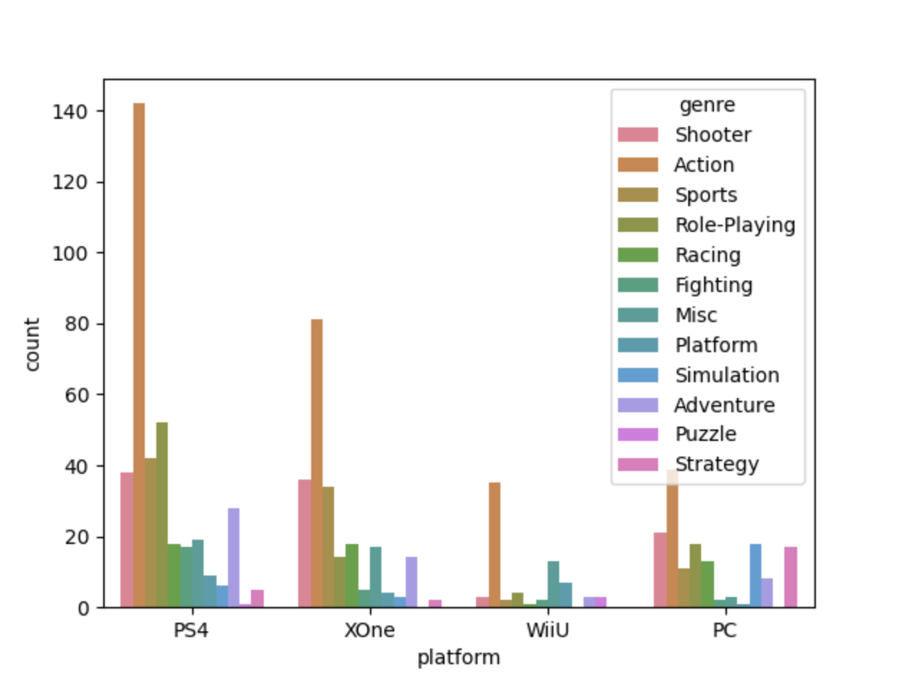

Now that we have our data it's time to graph it we're going to be using [seaborn](https://seaborn.pydata.org/) a visualization library.
The seaborn library is often shortened to sns. To do the graph we need we are going to use a count plot which counts occurrences of certain values in a dataset and creates a graph from it.  
Here's an example from their website:



using the method you only need a few more parameters to get a full chart.

x = the category of the x axis in our case the platforms.  
hue = the different categories inside a category from x in our case the gere.  
data = our dataframe

try to display the graph with following line 
```python
 
plt.show()
  
```

<div class="hint">

```python
sns.countplot(x='platform', hue='genre', data=df)
plt.show()
```
</div>

If it looks anything like the following you've got it right!
